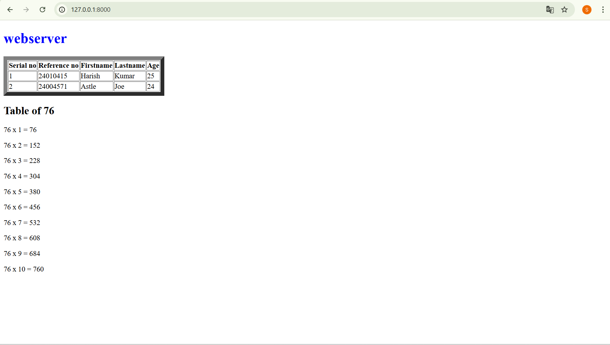

 
# EX01 Developing a Simple Webserver
## Date:

## AIM:
To develop a simple webserver to serve html pages and display the configuration details of laptop.

## DESIGN STEPS:
### Step 1: 
HTML content creation.

### Step 2:
Design of webserver workflow.

### Step 3:
Implementation using Python code.

### Step 4:
Serving the HTML pages.

### Step 5:
Testing the webserver.

## PROGRAM:
```html

<!DOCTYPE html>
<html lang="en">
<head>
    <meta charset="UTF-8">
    <meta name="viewport" content="width=device-width, initial-scale=1.0">
    <title>76th table</title>
</head>
<body>
    <h1 style="color:blue;">webserver</h1>

    <table border="9">
        <tr>
            <th>Serial no</th>
            <th>Reference no</th>
            <th>Firstname</th>
            <th>Lastname</th>
            <th>Age</th>
        </tr>
        <tr>
            <td>1</td>
            <td>24010415</td>
            <td>Harish</td>
            <td>Kumar</td>
            <td>25</td>
        </tr>
        <tr>
            <td>2</td>
            <td>24004571</td>
            <td>Astle</td>
            <td>Joe</td>
            <td>24</td>
        </tr>
    </table>
    <h2>Table of 76</h2>
    <p>76 x 1 = 76</p>
    <p>76 x 2 = 152</p>
    <p>76 x 3 = 228</p>
    <p>76 x 4 = 304</p>
    <p>76 x 5 = 380</p>
    <p>76 x 6 = 456</p>
    <p>76 x 7 = 532</p>
    <p>76 x 8 = 608</p>
    <p>76 x 9 = 684</p>
    <p>76 x 10 = 760</p>

</body>
</html>
```

## OUTPUT:



## RESULT:
The program for implementing simple webserver is executed successfully.
